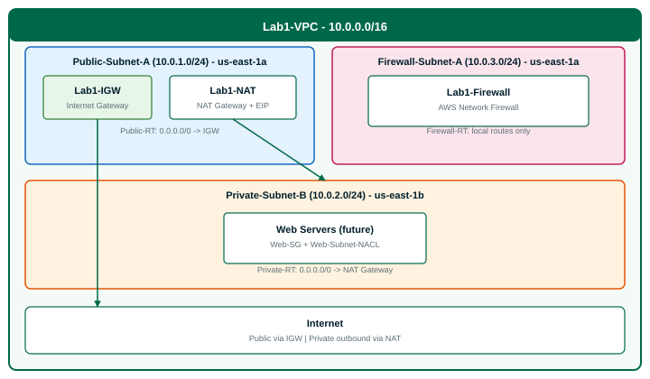

# Lab 1: VPC Networking & Firewall Subnet

**Estimated time:** 50–60 minutes  
**Tools needed:** AWS Console (web browser)  
**AWS region:** US East (N. Virginia) — **`us-east-1`** (required — subnet AZ names below assume this region)  
**AWS Free Tier:** Partially — VPC, subnets, IGW, route tables, NACLs, and security groups are free. **NAT Gateway (~$0.045/hour)** and **Network Firewall (~$0.395/hour)** incur charges. Complete within 1 hour, then tear down (see [Cost management](#cost-management-important)).

### Lab file locations

All paths below are relative to the **Lab 1 folder** (`Day_3_Lab_1_VPC_Networking_Firewall/`).

| File | Location in repo | When you need it |
|------|------------------|------------------|
| Lab instructions | `instructions.md` | This file — Steps 1–9 |
| Architecture diagram | `diagrams/lab1-vpc-architecture.svg` | Reference |
| Screenshot naming guide | `screenshots/README.md` | After each step |
| Instructor setup (instructors only) | `instructor/AWS_LAB1_SETUP.md` | Pre-class |

---

## Before you start (participants)

1. Sign in to the **AWS Console** with an account that can create VPC resources.
2. Set the region to **US East (N. Virginia)** — top-right corner must show **`us-east-1`** or **United States (N. Virginia)**.
3. Find your public IP: open a browser tab and search **"what is my IP"**. You need this for SSH rules in Steps 6 and 7. Example: if your IP is `203.0.113.45`, use **`203.0.113.45/32`** as the source CIDR.
4. Keep this lab guide open in a second window while you work in the console.

> **Naming is important.** Use the exact resource names in this guide (`Lab1-VPC`, `Public-Subnet-A`, etc.) so your instructor can verify your work quickly.

---

## AWS Console — how to find your lab resources

The console search box behavior **varies by page**. Use this table to avoid “No matching resource found” confusion:

| Page | Does typing `Lab1-VPC` in the search box work? | What to do instead |
|------|-----------------------------------------------|---------------------|
| **Your VPCs** | Yes — finds the VPC by name tag | Search `Lab1-VPC` |
| **Subnets** | Yes — filters subnets in that VPC | Search `Lab1-VPC` |
| **Route tables** | Yes — filters route tables in that VPC | Search `Lab1-VPC` |
| **Internet gateways** | Sometimes — may need to scroll | Look for `Lab1-IGW` |
| **NAT gateways** | Search by name | Search `Lab1-NAT` |
| **Network ACLs** | Search by name | Search `Web-Subnet-NACL` |
| **Security groups** | **No** — returns empty | Search **`Web-SG`** or **`Firewall-SG`**, or match your lab VPC ID in the **VPC** column |
| **Network Firewall** | N/A — use left menu | **Network Firewall** → **Firewalls** |

**Left navigation:** On every VPC page, the sidebar shows **Virtual private cloud** (Your VPCs, Subnets, Route tables, …) and **Security** (Network ACLs, Security groups). Stay in **VPC** service — do not open the separate **EC2 → Security Groups** page unless your instructor directs you there (both work, but this lab uses the VPC console path).

**Default resources:** Your account may already have a **default VPC** (`172.31.0.0/16`) and a default Internet Gateway. That is normal. You are building a **separate** lab VPC named **`Lab1-VPC`** (`10.0.0.0/16`).

---

## Lab objectives

By the end of this lab, you will be able to:

- Create a custom VPC with a CIDR block
- Create public, private, and firewall subnets across Availability Zones
- Configure an Internet Gateway and NAT Gateway
- Set up route tables for each subnet type
- Configure Network ACLs for subnet-level security
- Create security groups for web servers and the firewall
- Deploy AWS Network Firewall in a dedicated firewall subnet

---

## Architecture overview



```
┌─────────────────────────────────────────────────────────────────────────────┐
│                     Custom VPC: Lab1-VPC (10.0.0.0/16)                    │
│  ┌──────────────────────────┐   ┌──────────────────────────────────────┐  │
│  │ Public-Subnet-A          │   │ Firewall-Subnet-A                    │  │
│  │ 10.0.1.0/24 · us-east-1a │   │ 10.0.3.0/24 · us-east-1a             │  │
│  │  IGW + NAT Gateway       │   │  AWS Network Firewall (Lab1-Firewall)  │  │
│  └────────────┬─────────────┘   └──────────────────────────────────────┘  │
│               │                                                             │
│               ▼                                                             │
│  ┌────────────────────────────────────────────────────────────────────────┐ │
│  │ Private-Subnet-B · 10.0.2.0/24 · us-east-1b · Web servers (future)   │ │
│  └────────────────────────────────────────────────────────────────────────┘ │
│  Public-RT:  0.0.0.0/0 → IGW    Private-RT: 0.0.0.0/0 → NAT              │
│  Firewall-RT: local only                                                    │
└─────────────────────────────────────────────────────────────────────────────┘
```

**End-of-lab check (optional):** VPC → **Your VPCs** → select **`Lab1-VPC`** → **Resource map** tab. You should see subnets, route tables, IGW, and NAT connected.

---

## Step 1 — Create custom VPC

**Console path:** Top search bar → type **VPC** → open **VPC** → left menu **Your VPCs** → orange **Create VPC**

### Do this

1. On **Create VPC**, set **Resources to create** to **VPC only** (not “VPC and more”).
2. Configure:

| Setting | Value |
|---------|-------|
| **Name tag** | `Lab1-VPC` |
| **IPv4 CIDR block** | `10.0.0.0/16` |
| **IPv6 CIDR block** | No IPv6 CIDR block |
| **Tenancy** | Default |

3. Click **Create VPC**.
4. You return to **Your VPCs**. Confirm **`Lab1-VPC`** appears in the list.

### What you should see


| Column | Expected for Lab1-VPC |
|--------|------------------------|
| Name | `Lab1-VPC` |
| IPv4 CIDR | `10.0.0.0/16` |
| State | **Available** (green checkmark) |

You may also see a **default VPC** with CIDR `172.31.0.0/16` and no name — ignore it.

### Verify

| Check | Expected |
|-------|----------|
| VPC name | `Lab1-VPC` |
| IPv4 CIDR | `10.0.0.0/16` |
| State | Available |

**Screenshot:** Save as **`Step_01_VPC_Created.png`** — VPC list with `Lab1-VPC` visible.

**Checkpoint:** `"Step 1 completed"`

---

## Step 2 — Create subnets

**Console path:** VPC → left menu **Subnets** → **Create subnet**

### Do this

1. **VPC:** select **`Lab1-VPC`** from the dropdown.

2. **Subnet 1 — Public:**

| Setting | Value |
|---------|-------|
| **Subnet name** | `Public-Subnet-A` |
| **Availability Zone** | **us-east-1a** |
| **IPv4 CIDR block** | `10.0.1.0/24` |

3. Click **Add new subnet**.

4. **Subnet 2 — Private:**

| Setting | Value |
|---------|-------|
| **Subnet name** | `Private-Subnet-B` |
| **Availability Zone** | **us-east-1b** |
| **IPv4 CIDR block** | `10.0.2.0/24` |

5. Click **Add new subnet**.

6. **Subnet 3 — Firewall:**

| Setting | Value |
|---------|-------|
| **Subnet name** | `Firewall-Subnet-A` |
| **Availability Zone** | **us-east-1a** |
| **IPv4 CIDR block** | `10.0.3.0/24` |

7. Click **Create subnet**.

8. On the **Subnets** list, type **`Lab1-VPC`** in **Find subnets by attribute or tag**. You should see **Subnets (3)**.

### What you should see


| Name | IPv4 CIDR | VPC column |
|------|-----------|------------|
| `Public-Subnet-A` | 10.0.1.0/24 | `vpc-… \| Lab1-VPC` |
| `Private-Subnet-B` | 10.0.2.0/24 | `vpc-… \| Lab1-VPC` |
| `Firewall-Subnet-A` | 10.0.3.0/24 | `vpc-… \| Lab1-VPC` |

All **State** = **Available**.

### Verify

| Subnet name | AZ | CIDR |
|-------------|-----|------|
| `Public-Subnet-A` | us-east-1a | 10.0.1.0/24 |
| `Private-Subnet-B` | us-east-1b | 10.0.2.0/24 |
| `Firewall-Subnet-A` | us-east-1a | 10.0.3.0/24 |

**Screenshot:** Save as **`Step_02_Subnets_Created.png`** — filtered list showing all three subnets.

**Checkpoint:** `"Step 2 completed"`

---

## Step 3 — Create and attach Internet Gateway

**Console path:** VPC → **Internet gateways** → **Create internet gateway**

### Do this

1. **Name tag:** `Lab1-IGW` → **Create internet gateway**.
2. Select **`Lab1-IGW`** in the list → **Actions** → **Attach to VPC**.
3. **Available VPCs:** choose **`Lab1-VPC`** → **Attach internet gateway**.

### What you should see


| Column | Expected |
|--------|----------|
| Name | `Lab1-IGW` |
| State | **Attached** (green checkmark) |
| VPC ID | `vpc-… \| Lab1-VPC` |

Another attached IGW for the default VPC may appear — that is not your lab resource.

### Verify

| Check | Expected |
|-------|----------|
| Name | `Lab1-IGW` |
| State | Attached |
| Attached VPC | Lab1-VPC |

**Screenshot:** Save as **`Step_03_IGW_Attached.png`**.

**Checkpoint:** `"Step 3 completed"`

---

## Step 4 — Create route tables

You will create **three** custom route tables and associate each with one subnet. The VPC will also keep a **main** route table — that fourth row is **normal**; do not delete it.

**Console path:** VPC → **Route tables** → **Create route table**

### 4A — Public route table

1. Create:

| Setting | Value |
|---------|-------|
| **Name** | `Public-RT` |
| **VPC** | `Lab1-VPC` |

2. Click **Create route table**.

3. Select **`Public-RT`** → bottom panel **Routes** tab → **Edit routes** → **Add route**:

| Destination | Target |
|-------------|--------|
| `0.0.0.0/0` | **Internet Gateway** → `Lab1-IGW` |

4. **Save changes**.

5. **Subnet associations** tab → **Edit subnet associations** → check **`Public-Subnet-A`** only → **Save associations**.

### 4B — Private route table

1. **Create route table:** Name **`Private-RT`**, VPC **`Lab1-VPC`**.
2. Do **not** add an internet route yet (NAT comes in Step 5).
3. **Subnet associations** → associate **`Private-Subnet-B`** only.

### 4C — Firewall route table

1. **Create route table:** Name **`Firewall-RT`**, VPC **`Lab1-VPC`**.
2. Leave routes at default (`10.0.0.0/16` → local only).
3. **Subnet associations** → associate **`Firewall-Subnet-A`** only.

### What you should see


Filter **Route tables** with **`Lab1-VPC`**. Expect **four** rows:

| Name | Main | Explicit subnet association |
|------|------|----------------------------|
| `Public-RT` | No | 1 subnet (Public-Subnet-A) |
| *(unnamed / dash)* | **Yes** | — (main route table; no lab subnet) |
| `Private-RT` | No | 1 subnet (Private-Subnet-B) |
| `Firewall-RT` | No | 1 subnet (Firewall-Subnet-A) |

**Also verify:** Select **`Public-RT`** → **Routes** tab → you must see:

| Destination | Target | Status |
|-------------|--------|--------|
| `10.0.0.0/16` | local | Active |
| `0.0.0.0/0` | `igw-…` (Lab1-IGW) | Active |

Include this Routes view in your screenshot if it does not fit in the list view.

### Verify

| Route table | Associated subnet | Key route |
|-------------|-------------------|-----------|
| `Public-RT` | Public-Subnet-A | 0.0.0.0/0 → Lab1-IGW |
| `Private-RT` | Private-Subnet-B | local only (for now) |
| `Firewall-RT` | Firewall-Subnet-A | local only |

**Screenshot:** Save as **`Step_04_Route_Tables.png`**.

**Checkpoint:** `"Step 4 completed"`

---

## Step 5 — Create NAT Gateway (private subnet internet access)

> **Cost:** NAT Gateway costs approximately **$0.045/hour** plus data processing. Delete it when the lab is finished.

**Console path:** VPC → **NAT gateways** → **Create NAT gateway**

> **Console tip — Availability mode:** AWS may default to **Regional**, which only shows a **VPC** dropdown (no subnet picker). For this lab, select **Zonal** first — that unlocks the **Subnet** field so you can choose `Public-Subnet-A`. **Connectivity type** stays **Public**.

### Do this

1. Configure:

| Setting | Value |
|---------|-------|
| **Name** | `Lab1-NAT` |
| **Availability mode** | **Zonal** (required to select a subnet) |
| **Subnet** | `Public-Subnet-A` |
| **Connectivity type** | Public |
| **Elastic IP allocation ID** | Click **Allocate Elastic IP** (creates a new EIP) |

2. Click **Create NAT gateway**.

3. Wait 1–2 minutes. Open the NAT detail page — **State** must be **`Available`** before continuing.

4. **Update Private route table:**
   - **Route tables** → **`Private-RT`**
   - **Routes** → **Edit routes** → **Add route**:

| Destination | Target |
|-------------|--------|
| `0.0.0.0/0` | **NAT Gateway** → `Lab1-NAT` |

5. **Save changes**.

### What you should see

**Part A — NAT detail** (click `Lab1-NAT` in the list):


| Field | Expected |
|-------|----------|
| Name | `Lab1-NAT` |
| State | **Available** |
| Subnet | `Public-Subnet-A` |
| Connectivity type | Public |
| Primary public IPv4 address | An Elastic IP (e.g. `100.x.x.x`) |

**Part B — Private-RT routes:**


| Destination | Target | Status |
|-------------|--------|--------|
| `10.0.0.0/16` | local | Active |
| `0.0.0.0/0` | `nat-…` | Active |

Save one or two images as **`Step_05_NAT_Gateway.png`** (both parts if possible).

### Verify

| Check | Expected |
|-------|----------|
| NAT Gateway name | `Lab1-NAT` |
| NAT state | Available |
| NAT subnet | Public-Subnet-A |
| Private-RT route | 0.0.0.0/0 → nat-... |

**Checkpoint:** `"Step 5 completed"`

---

## Step 6 — Configure Network ACL (NACL)

Network ACLs are **stateless** subnet firewalls. Rule numbers determine priority — **lower number = evaluated first**.

**Console path:** VPC → **Network ACLs** → **Create network ACL**

### Do this

1. Create:

| Setting | Value |
|---------|-------|
| **Name** | `Web-Subnet-NACL` |
| **VPC** | `Lab1-VPC` |

2. Click **Create network ACL**.

3. Select **`Web-Subnet-NACL`** → **Inbound rules** → **Edit inbound rules**.

Add rules in this order (**Add new rule** for each row):

| Rule # | Type | Protocol | Port range | Source | Allow/Deny |
|--------|------|----------|------------|--------|------------|
| 100 | HTTP | TCP | 80 | 0.0.0.0/0 | ALLOW |
| 110 | HTTPS | TCP | 443 | 0.0.0.0/0 | ALLOW |
| 120 | SSH | TCP | 22 | **YOUR-IP/32** | ALLOW |
| 130 | Custom TCP | TCP | 1024-65535 | 0.0.0.0/0 | ALLOW |
| 200 | All traffic | All | All | 0.0.0.0/0 | DENY |

Replace **YOUR-IP/32** with the IP from [Before you start](#before-you-start-participants).

4. **Save changes**.

5. **Outbound rules** → **Edit outbound rules**:

| Rule # | Type | Protocol | Port range | Destination | Allow/Deny |
|--------|------|----------|------------|-------------|------------|
| 100 | All traffic | All | All | 0.0.0.0/0 | ALLOW |

6. **Save changes**.

7. **Subnet associations** → **Edit subnet associations** → check **`Private-Subnet-B`** → **Save changes**.

### What you should see

**Part A — Inbound rules + Details:**


- **Details** panel: **Associated with** → `Private-Subnet-B`
- **Inbound rules:** 100–130 ALLOW, 200 DENY, plus default `*` DENY at bottom (AWS default — expected)

**Part B — Subnet associations tab:**


- One row: **`Private-Subnet-B`** · CIDR `10.0.2.0/24` · AZ `us-east-1b`

### Verify

| Check | Expected |
|-------|----------|
| NACL name | Web-Subnet-NACL |
| Inbound rules | HTTP, HTTPS, SSH (your IP), ephemeral TCP, then DENY |
| Associated subnet | Private-Subnet-B |

**Screenshot:** Save as **`Step_06_NACL_Rules.png`** (inbound rules + association).

**Checkpoint:** `"Step 6 completed"`

---

## Step 7 — Create security groups

Security groups are **stateful** — if inbound is allowed, return traffic is automatically permitted.

> **Important:** On **Security groups**, searching **`Lab1-VPC`** shows **“No matching resource found”**. Search by security group **name** instead (`Web-SG`, `Firewall-SG`). See [AWS Console — how to find your lab resources](#aws-console-how-to-find-your-lab-resources).

### 7A — Web server security group

**Console path:** VPC → **Security groups** → **Create security group**

| Setting | Value |
|---------|-------|
| **Security group name** | `Web-SG` |
| **Description** | `Security group for web servers` |
| **VPC** | `Lab1-VPC` |

**Inbound rules:**

| Type | Protocol | Port | Source | Description |
|------|----------|------|--------|-------------|
| HTTP | TCP | 80 | 0.0.0.0/0 | Allow web traffic |
| SSH | TCP | 22 | **YOUR-IP/32** | Allow SSH from your IP |

**Outbound rules:** Leave default (**All traffic** → 0.0.0.0/0).

Click **Create security group**.

### 7B — Firewall security group

**Create security group:**

| Setting | Value |
|---------|-------|
| **Security group name** | `Firewall-SG` |
| **Description** | `Security group for network firewall` |
| **VPC** | `Lab1-VPC` |

**Inbound rules:**

| Type | Protocol | Port | Source | Description |
|------|----------|------|--------|-------------|
| HTTP | TCP | 80 | 10.0.0.0/16 | Allow from VPC |
| HTTPS | TCP | 443 | 10.0.0.0/16 | Allow from VPC |

**Outbound rules:** Leave default.

Click **Create security group**.

### What you should see

**Finding your groups:** Clear any filters. Search **`Web-SG`**. Confirm **VPC ID** column points to your lab VPC (`vpc-…` — same ID as `Lab1-VPC`). Repeat for **`Firewall-SG`**.

**Part A — Web-SG → Inbound rules:**


| Type | Port | Source |
|------|------|--------|
| SSH | 22 | Your IP/32 |
| HTTP | 80 | 0.0.0.0/0 |

**Part B — Firewall-SG → Inbound rules:**


| Type | Port | Source |
|------|------|--------|
| HTTP | 80 | 10.0.0.0/16 |
| HTTPS | 443 | 10.0.0.0/16 |

### Verify

| Security group | Key inbound rules |
|----------------|-------------------|
| `Web-SG` | HTTP:80 from 0.0.0.0/0, SSH:22 from your IP |
| `Firewall-SG` | HTTP:80 and HTTPS:443 from 10.0.0.0/16 |

**Screenshot:** Save as **`Step_07_Security_Groups.png`** (both inbound rule tabs).

**Checkpoint:** `"Step 7 completed"`

---

## Step 8 — Create AWS Network Firewall

> **Cost:** Network Firewall costs approximately **$0.395/hour**. Delete the firewall when finished.

**Console path:** VPC left menu → **Network Firewall** → **Firewalls** → **Create firewall**

> **Tip:** Start Step 8 before Step 6 if you are short on time — provisioning takes **5–10 minutes** and can run while you configure NACLs.

### 8A — Create stateful rule group first

1. On the firewall creation page, under **Firewall policy**, click **Create firewall policy**.
2. On the policy page, click **Add rule group** → **Create stateful rule group**.

| Setting | Value |
|---------|-------|
| **Name** | `Allow-Web-Traffic` |
| **Capacity** | 100 |

> **Console tip:** On **Create Network Firewall rule group**, set the **rule group name** at the **top** of the page (`Allow-Web-Traffic`). Under **Standard stateful rules**, select **5-tuple** — **not** **Category matching**. Category matching does not provide named rules or TCP port actions. Skip **IP set reference** (leave empty).

3. Under **Stateful rule order** (5-tuple mode), click **Add rule** and add:

| Rule name | Source | Destination | Protocol | Action |
|-----------|--------|-------------|----------|--------|
| `allow-http` | 10.0.0.0/16 | 0.0.0.0/0 | TCP:80 | PASS |
| `allow-https` | 10.0.0.0/16 | 0.0.0.0/0 | TCP:443 | PASS |
| `deny-ssh` | 10.0.0.0/16 | 0.0.0.0/0 | TCP:22 | DROP |

4. Click **Create rule group**.

5. Back on **Create firewall policy**:

| Setting | Value |
|---------|-------|
| **Policy name** | `Lab1-Firewall-Policy` |

6. Ensure **`Allow-Web-Traffic`** is listed under **Stateful rule groups** → **Create firewall policy**.

### 8B — Create the firewall

1. **Network Firewall** → **Firewalls** → **Create firewall**

| Setting | Value |
|---------|-------|
| **Name** | `Lab1-Firewall` |
| **VPC** | `Lab1-VPC` |
| **Subnet** | `Firewall-Subnet-A` |
| **Firewall policy** | `Lab1-Firewall-Policy` |

2. Click **Create firewall**.

3. Wait until **Status** = **`READY`** (may show **`PROVISIONING`** first — refresh every minute).

### What you should see

**Firewall list:** **Network Firewall** → **Firewalls** → `Lab1-Firewall` · Status **READY** · VPC **Lab1-VPC** · Subnet **Firewall-Subnet-A**.

**Firewall policy:** **Network Firewall** → **Firewall policies** → **`Lab1-Firewall-Policy`**:


- **Stateful rule groups (1):** `Allow-Web-Traffic` · Capacity **100**
- **Capacity units consumed by stateful rule groups:** **100/30,000**

Open **`Allow-Web-Traffic`** to confirm the three rules (allow-http, allow-https, deny-ssh).

### Verify

| Check | Expected |
|-------|----------|
| Firewall name | Lab1-Firewall |
| Status | READY (PROVISIONING OK while waiting) |
| VPC / subnet | Lab1-VPC / Firewall-Subnet-A |
| Policy | Lab1-Firewall-Policy with Allow-Web-Traffic |

**Screenshot:** Save as **`Step_08_Network_Firewall.png`**.

**Checkpoint:** `"Step 8 completed"`

---

## Step 9 — Review firewall endpoint (optional — advanced)

AWS Network Firewall creates **VPC endpoints** in your firewall subnet for traffic inspection. Full inline routing through the firewall requires additional route table updates beyond this introductory lab.

**Console path:** **Network Firewall** → **Firewalls** → **`Lab1-Firewall`** → **Details** (or **Firewall details**)

### Do this

1. Note the **Endpoint ID** (format: `vpce-xxxxxxxx`) and **Status** **READY**.
2. Confirm subnet **`Firewall-Subnet-A`**.

**Alternate verification:** VPC → **Subnets** → **`Firewall-Subnet-A`** → **Details** tab — Route table = **`Firewall-RT`**, State = **Available**:


### Verify

| Field | Expected |
|-------|----------|
| Firewall status | READY |
| Endpoint ID | Present (`vpce-…`) on firewall Details |
| Subnet | Firewall-Subnet-A |

**Screenshot (optional):** Save as **`Step_09_Firewall_Endpoint.png`**.

**Checkpoint:** `"Step 9 completed – Lab 1 complete"`

---

## Lab 1 deliverables checklist

| # | Deliverable | Done |
|---|-------------|:----:|
| 1 | Custom VPC `Lab1-VPC` (10.0.0.0/16) | ☐ |
| 2 | Public, Private, Firewall subnets created | ☐ |
| 3 | Internet Gateway attached | ☐ |
| 4 | Route tables configured (Public→IGW, Private→NAT) | ☐ |
| 5 | NAT Gateway created and private route updated | ☐ |
| 6 | Network ACL `Web-Subnet-NACL` configured | ☐ |
| 7 | Security groups `Web-SG` and `Firewall-SG` created | ☐ |
| 8 | AWS Network Firewall deployed | ☐ |
| 9 | (Optional) Firewall endpoint reviewed | ☐ |

**Optional overview screenshot:** VPC → **`Lab1-VPC`** → **Resource map** tab.

---

## Bonus challenge

**Question:** Your private subnet web servers need to download security patches from the internet. They have no public IP addresses. How do they access the internet?

<details>
<summary>Answer</summary>

**NAT Gateway** in the public subnet. The private route table sends `0.0.0.0/0` traffic to the NAT Gateway, which uses its Elastic IP to reach the internet on behalf of private instances. Traffic is outbound-only — the internet cannot initiate connections to private instances directly.

</details>

---

## Troubleshooting

| Issue | Possible cause | Solution |
|-------|----------------|----------|
| **Security groups: “No matching resource found” for `Lab1-VPC`** | Search box matches SG fields, not VPC name tag | Search **`Web-SG`** / **`Firewall-SG`**, or match **VPC ID** column to your lab VPC |
| **Subnets filter works but Security groups filter does not** | Expected AWS behavior | Use the [resource finder table](#aws-console-how-to-find-your-lab-resources) above |
| **No Subnet field on NAT create page** | **Regional** availability mode selected | Switch **Availability mode** to **Zonal**, then select `Public-Subnet-A` |
| Can't create NAT Gateway | No Elastic IP available | Click **Allocate Elastic IP** on the NAT creation page |
| NAT stuck in Pending | Subnet not public | Confirm NAT is in `Public-Subnet-A` and Public-RT has 0.0.0.0/0 → IGW |
| Private subnet has no internet (later labs) | Missing NAT route | Add 0.0.0.0/0 → Lab1-NAT on `Private-RT` |
| NACL blocking traffic | Default deny rule | Ensure ALLOW rules have **lower** rule numbers than DENY (100–130 before 200) |
| SSH rule not working | Wrong CIDR format | Use `YOUR.IP.ADDRESS/32`, not bare IP |
| Four route tables instead of three | Main route table is automatic | Keep the **Main** row; lab subnets must use Public/Private/Firewall-RT |
| Default VPC visible alongside Lab1-VPC | Normal account state | Only grade resources inside **`Lab1-VPC`** (`10.0.0.0/16`) |
| Firewall not provisioning | Wrong subnet/VPC | Firewall must be in `Firewall-Subnet-A` inside `Lab1-VPC` |
| VPC CIDR conflict | 10.0.0.0/16 already in use | Delete lab VPC or use 172.16.0.0/16 (update all subnet CIDRs consistently) |
| Wrong region | AZ names differ | Switch console to **us-east-1** before creating subnets |

---

## Cost management (important)

| Resource | Approximate cost | Lab duration | Est. cost |
|----------|------------------|--------------|-----------|
| VPC, subnets, IGW, route tables, NACLs, SGs | Free | — | $0 |
| NAT Gateway | ~$0.045/hour | 1 hour | ~$0.05 |
| Network Firewall | ~$0.395/hour | 1 hour | ~$0.40 |
| **Total** | | **~1 hour** | **~$0.45** |

### Tear down after lab (recommended order)

1. **Network Firewall** → delete `Lab1-Firewall` → delete `Lab1-Firewall-Policy` → delete `Allow-Web-Traffic` rule group
2. **NAT Gateways** → delete `Lab1-NAT` → wait until deleted
3. **Elastic IPs** → release the EIP used by NAT (shows as unused after NAT delete)
4. **VPC** → delete `Lab1-VPC` (deletes subnets, route tables, IGW detach, NACLs, and security groups)

> Deleting the VPC fails if NAT or Firewall still exist — delete those first.

---

## Summary — what you learned

| Concept | How you applied it |
|---------|---------------------|
| **Custom VPC** | Isolated network with CIDR 10.0.0.0/16 |
| **Subnets** | Public, private, and firewall tiers in different AZs |
| **Internet Gateway** | Internet access for the public subnet |
| **NAT Gateway** | Outbound internet for private instances |
| **Route tables** | Per-subnet routing (IGW vs NAT vs local) |
| **Network ACLs** | Stateless subnet firewall with ordered rules |
| **Security groups** | Stateful instance-level firewall |
| **AWS Network Firewall** | Managed inspection service in a dedicated subnet |

**Lab 1 complete.** You built a production-style VPC with segmented subnets and layered network controls.
