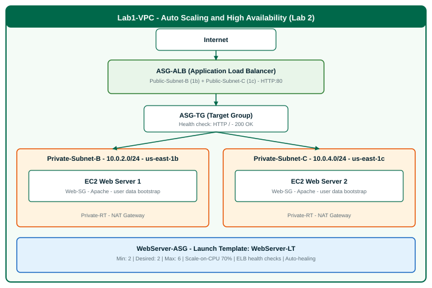

# Lab 2: Auto Scaling & High Availability

**Folder:** `Day_3_Lab_2_Auto_Scaling_High_Availability`  
**Estimated time:** 45–50 minutes  
**Module alignment:** Module 11 (Failover Testing & Capacity Planning) · Module 10 (High Availability)  
**AWS region:** US East (N. Virginia) — `us-east-1`

---

## Start here

1. **Complete [Day 3 Lab 1](../Day_3_Lab_1_VPC_Networking_Firewall/instructions.md) first** — you need `Lab1-VPC`, `Web-SG`, NAT Gateway, and route tables.
2. Set AWS Console region to **`us-east-1`** (US East · N. Virginia) — check the **top-right corner** before every step.
3. Open **[instructions.md](instructions.md)** and follow Steps 1–14.
4. Use the **[screenshot checklist](instructions.md#aws-region-and-screenshot-checklist)** to know exactly what to capture in the console for each step.

> **Stuck with one instance restarting?** If **us-east-1c** is fine but **us-east-1b** keeps cycling, see [If one instance keeps restarting](instructions.md#if-one-instance-keeps-restarting-common-issue) in the instructions — usually the ALB needs **`Public-Subnet-B` + `Public-Subnet-C`**.

---

## Screenshots — region and console pages

| | |
|--|--|
| **Region** | **`us-east-1`** (N. Virginia) — required for all AWS Console work |
| **Show in every console screenshot** | Region selector (top-right) + resource name from the step |
| **Full checklist** | [instructions.md — AWS region and screenshot checklist](instructions.md#aws-region-and-screenshot-checklist) |
| **Filename guide** | [screenshots/README.md](screenshots/README.md) |

**Quick reference — where to go in the console:**

| Steps | Console |
|-------|---------|
| 1 | VPC → Subnets (Steps 1B–1D) |
| 2 | EC2 → Launch Templates |
| 3, 8, 12 | EC2 → Target Groups |
| 4, 5 | EC2 → Load Balancers |
| 6, 7, 11, 14 | EC2 → Auto Scaling Groups |
| 9, 12 | Web browser → ALB DNS name |
| 10 | EC2 → Instances |
| 13 | Your written recovery time notes (not a single AWS page) |

---

## What you need

| Item | Source |
|------|--------|
| Lab steps | [instructions.md](instructions.md) |
| Prerequisites | [Lab 1 complete](../Day_3_Lab_1_VPC_Networking_Firewall/README.md) |
| User data script | [setup/user_data.sh](setup/user_data.sh) |
| AWS account | Your own or instructor-provided |
| Region | **us-east-1** (required) |
| EC2 key pair | Existing key pair |
| Architecture diagram | [diagrams/lab2-asg-architecture.svg](diagrams/lab2-asg-architecture.svg) |
| Screenshot guide | [screenshots/README.md](screenshots/README.md) |
| Reference screenshots (local) | `Lab Screenshots Day 3/Lab 2/README.md` — **do not commit PNGs** |
| Console UI troubleshooting | [instructor/CONSOLE_UI_GUIDE.md](instructor/CONSOLE_UI_GUIDE.md) |

> **Instructor materials** (setup guide, answer key, validation script) are in the [`instructor/`](instructor/) folder.

---

## Cost warning

ALB and two t2.micro instances are free-tier friendly for short lab use. **NAT Gateway from Lab 1 (~$0.045/hr) continues to incur charges.** Tear down Lab 2 resources when finished (see [instructions.md — Cost management](instructions.md#cost-management-important)).

---

## Related labs

| Lab | Topic |
|-----|-------|
| [Lab 1](../Day_3_Lab_1_VPC_Networking_Firewall/README.md) | VPC networking, NACLs, security groups, Network Firewall |
| **This lab (2)** | Auto Scaling Group, ALB, cross-AZ high availability, auto-healing |
| [Lab 3](../Day_3_Lab_3_Alerting_Auto_Scaling_Events/README.md) | SNS alerts, CloudWatch alarms, EventBridge rules, dashboard |
| Lab 9–12 | Workbook exercises (reliability, DR, monitoring, automation) |
