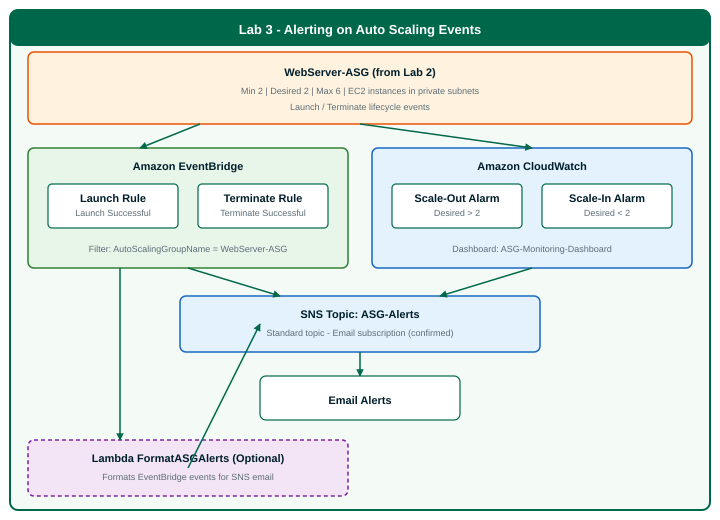

# Lab 3: Alerting on Auto Scaling Events

**Folder:** `Day_3_Lab_3_Alerting_Auto_Scaling_Events`  
**Estimated time:** 35–40 minutes  
**Module alignment:** Module 12 (Alerting and Notification Automation · Monitoring Automation)  
**AWS region:** US East (N. Virginia) — `us-east-1`

---

## Start here

1. **Complete [Day 3 Lab 2](../Day_3_Lab_2_Auto_Scaling_High_Availability/instructions.md) first** — you need `WebServer-ASG` running with desired capacity 2.
2. Confirm AWS Console region is **`us-east-1`** (N. Virginia) — **show the region (top-right) in every AWS screenshot**.
3. Have a **real email address** ready for SNS subscription confirmation.
4. Open **[instructions.md](instructions.md)** and follow Steps 1–14.
5. Before each screenshot, check **[AWS region and screenshot checklist](instructions.md#aws-region-and-screenshot-checklist)** — console path and what must be visible.
6. Compare your screen to **local reference captures** in `Lab Screenshots Day 3/Lab 3/` (**do not commit PNGs to git**).

---

## What you need

| Item | Source |
|------|--------|
| Lab steps | [instructions.md](instructions.md) |
| Prerequisites | [Lab 2 complete](../Day_3_Lab_2_Auto_Scaling_High_Availability/README.md) |
| Lambda code (optional Step 12) | [setup/format_asg_alerts.py](setup/format_asg_alerts.py) |
| AWS account | Your own or instructor-provided |
| Region | **us-east-1** (required) |
| Email address | For SNS subscription (must confirm link) |
| Architecture diagram | [diagrams/lab3-alerting-architecture.svg](diagrams/lab3-alerting-architecture.svg) |
| Screenshot guide | [screenshots/README.md](screenshots/README.md) |
| Reference screenshots (local) | `Lab Screenshots Day 3/Lab 3/README.md` — **do not commit PNGs** |

> **Instructor materials** (setup guide, answer key, validation script) are in the [`instructor/`](instructor/) folder.

---

## Cost warning

SNS, CloudWatch alarms, EventBridge rules, and Lambda are **free-tier friendly** for this lab. **NAT Gateway and ALB from Labs 1–2 continue to incur hourly charges.** Delete Lab 3 resources when finished (see [instructions.md — Cost management](instructions.md#cost-management-important)).

---

## Related labs

| Lab | Topic |
|-----|-------|
| [Lab 1](../Day_3_Lab_1_VPC_Networking_Firewall/README.md) | VPC networking, NACLs, security groups, Network Firewall |
| [Lab 2](../Day_3_Lab_2_Auto_Scaling_High_Availability/README.md) | Auto Scaling Group, ALB, cross-AZ high availability, auto-healing |
| **This lab (3)** | SNS alerts, CloudWatch alarms, EventBridge rules, dashboard, optional Lambda formatting |
| Lab 9–12 | Workbook exercises (reliability, DR, monitoring, automation) |
