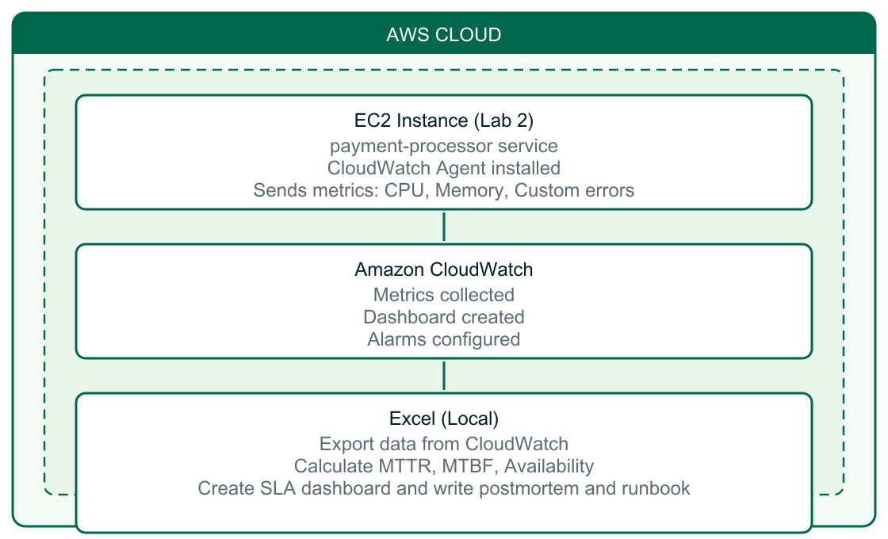

# Lab 3: SLA Compliance, Operational Reporting & Blameless Postmortem

**Estimated time:** 45–50 minutes  
**Prerequisite:** Lab 2 EC2 instance with `payment-processor` running and fixed

---

## Start here

1. Complete **[Lab 2](../Lab_02_Linux_Debugging_Root_Cause_Analysis/)** (live EC2) — `payment-processor` must be **active (running)**.
2. Copy [template/lab3_starter.xlsx](template/lab3_starter.xlsx) → `lab3_[yourname].xlsx` (all 7 sheets pre-built).
3. Open **[instructions.md](instructions.md)** and follow Steps 1–14.

---

## What you need

| Item | Source |
|------|--------|
| Lab steps | [instructions.md](instructions.md) |
| EC2 public IP and `.pem` key | Instructor (from Lab 2) |
| AWS region | **US East (N. Virginia) — `us-east-1`** |
| Starter workbook | [template/lab3_starter.xlsx](template/lab3_starter.xlsx) |
| Helper scripts (optional) | [setup/send_metrics.sh](setup/send_metrics.sh), [setup/cloudwatch_agent_config.json](setup/cloudwatch_agent_config.json) |

**Workbook sheets:** Raw Metrics · SLA Calculations · MTTR MTBF · Availability · KPI Dashboard · Postmortem · Runbook

> Instructor materials (setup guide, solution workbook, answer key) are in the `instructor/` folder.
