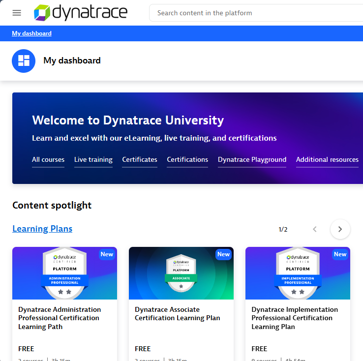
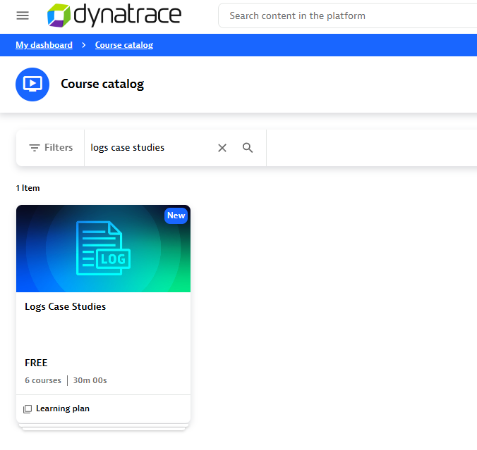
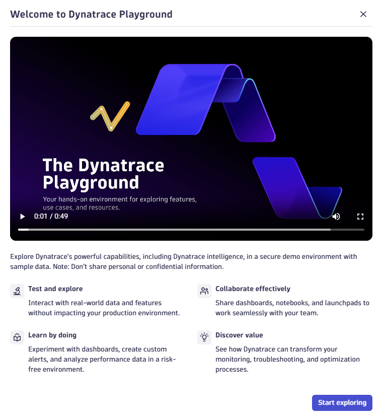
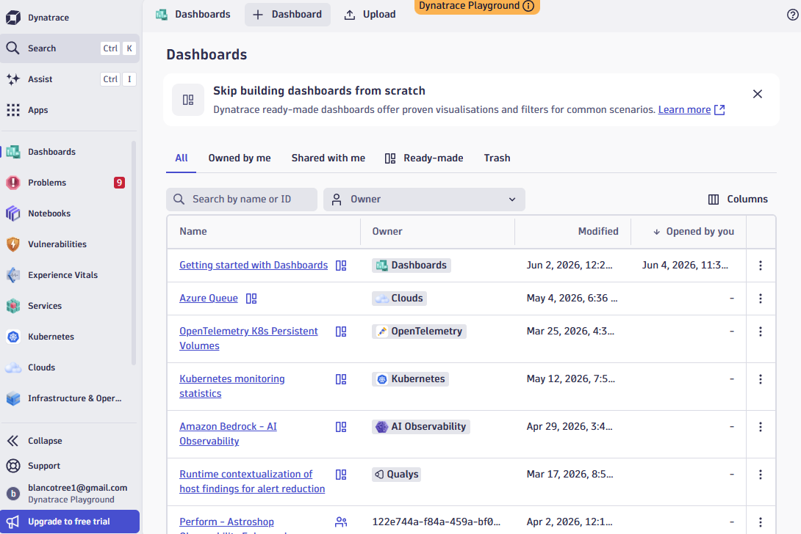
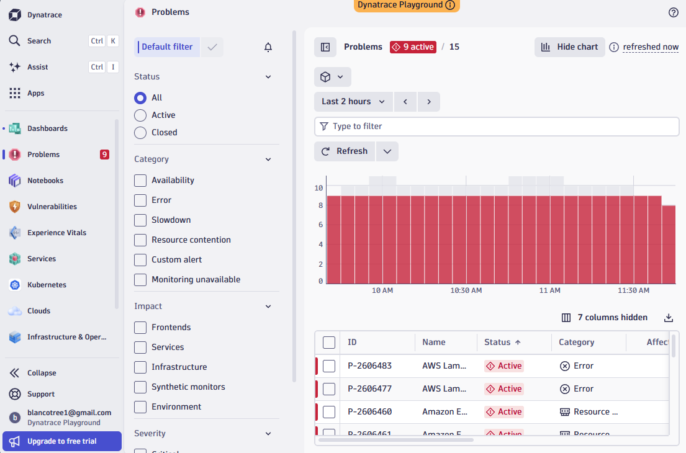
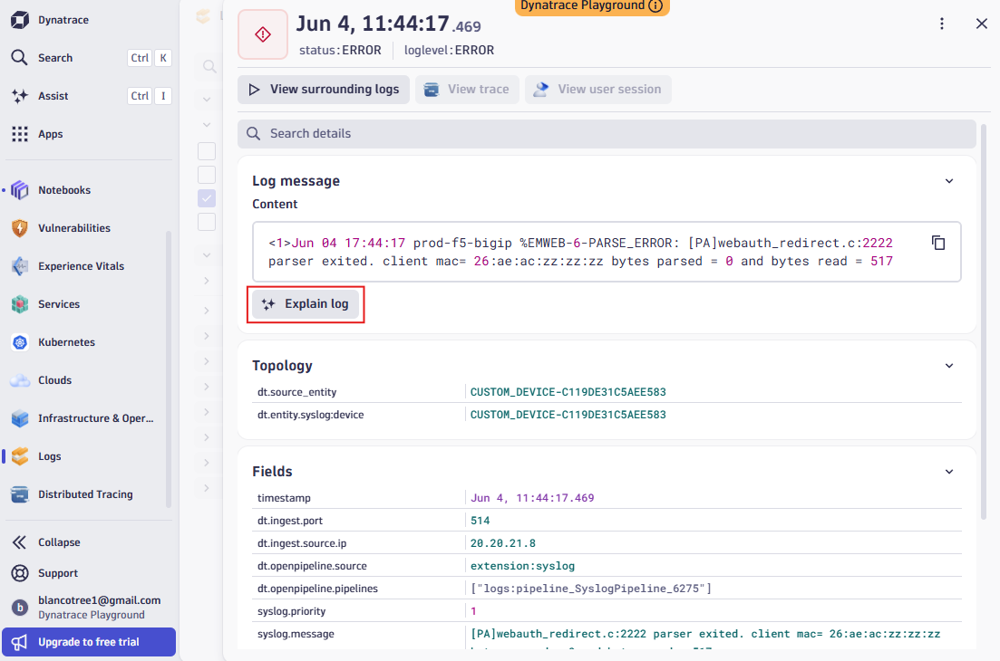

# Lab 3.1 – Dynatrace Observability

**Duration:** ~60 minutes  
**Prerequisites:** A web browser and an email address to create a free account

## Learning Objectives

By the end of this lab you will be able to:
- Create a Dynatrace University account and navigate the course catalog
- Describe how logs, problems, and dashboards relate to observability
- Explore a live Dynatrace environment using the Playground
- Use the AI-assisted log explanation feature to interpret an error log entry

---

## Overview

Dynatrace is an observability platform used by enterprise teams to monitor application performance, infrastructure health, and security across complex distributed environments. It ingests logs, metrics, and traces from services and infrastructure, then applies AI to surface problems and explain what is happening.

This lab has two parts. First, you will complete a short course on the Dynatrace University platform to build foundational knowledge about log monitoring. Then you will explore the Dynatrace Playground, a live demo environment with real sample data, to see how the platform works in practice.

---

## Hands On

### Part 1 – Create a Dynatrace University Account

1. Open a browser and navigate to **university.dynatrace.com**.

2. Click **Sign up** and create a free account using your email address. If you already have an account, log in.

3. After logging in you will land on the **My Dashboard** page. This is your learning home. From here you can access the course catalog, learning plans, certifications, and the Dynatrace Playground.

   

---

### Part 2 – Complete the Logs Case Studies Course

The Logs Case Studies course walks through real-world scenarios showing how teams use Dynatrace log monitoring to investigate problems. It is free, takes about 30 minutes, and is made up of 6 short modules.

4. Click **Course catalog** in the top navigation (or browse from the dashboard).

5. In the search bar, type `logs case studies` and press Enter. The course will appear as the only result.

   

6. Click the course tile and enroll. Work through all 6 modules in order. Each module presents a scenario, shows how logs are used to investigate it, and ends with a short knowledge check.

   As you go through the course, pay attention to:
   - How log queries are structured to filter by severity, service, and time range
   - How log entries connect to traces and the services that produced them
   - How AI assistance helps interpret log messages that are difficult to read

7. Complete all modules and note your completion status on the dashboard before moving to Part 3.

---

### Part 3 – Explore the Dynatrace Playground

The Dynatrace Playground is a live environment populated with sample data from a fictional application stack. It is safe to click around freely. Nothing you do here affects any real system.

8. From the Dynatrace University dashboard, click **Dynatrace Playground** in the top navigation, or look for the Playground tile. Click **Start exploring** when the welcome dialog appears.

   

9. After entering the Playground, take a moment to review the left sidebar. The main navigation areas are:

   | Section | What it shows |
   |---|---|
   | Dashboards | Pre-built and custom visualizations |
   | Problems | Active and resolved incidents detected by AI |
   | Logs | Ingested log data across all monitored services |
   | Services | Application services and their health |
   | Notebooks | Collaborative analysis documents |
   | Kubernetes | Cluster and workload health |
   | Infrastructure & Operations | Hosts and infrastructure metrics |

---

#### Explore Dashboards

10. Click **Dashboards** in the left sidebar. You will see a list of ready-made dashboards covering areas like Kubernetes, cloud services, and OpenTelemetry.

    

11. Open the **Getting started with Dashboards** entry. Review the layout, tiles, and filters. Notice how each tile can represent a different metric, log query, or service indicator. Dashboards in real environments are built and shared across operations teams to provide shared situational awareness during incidents.

---

#### Explore Problems

12. Click **Problems** in the left sidebar. The Problems view shows all incidents Dynatrace has automatically detected using its AI engine (called Davis).

    

13. Review the active problems list. For each problem, Dynatrace shows the problem ID, name, category (Error, Slowdown, Availability, Resource contention), and affected entities. Click into one active problem and read through the root cause analysis Dynatrace provides. Notice how it links the problem back to a specific service, host, or deployment event.

14. Use the **Category** filters on the left to narrow the list to only **Error** problems, then only **Slowdown** problems. Observe how different categories surface different types of operational concern.

---

#### Explore Logs

15. Click **Logs** in the left sidebar. Apply a filter for `status: ERROR` to see only error-level log entries. Browse a few entries.

16. Click into any log entry to open the detail panel. You will see the raw log message, the source entity, field metadata, and options to **View surrounding logs** and **View trace**.

17. Find a log entry with an **Explain log** button and click it. Dynatrace will use AI to interpret the raw log message in plain language, identifying what the error means and suggesting what may have caused it.

    

    This feature is particularly useful for log formats that are difficult to read without deep knowledge of the source system, such as syslog, application server output, or infrastructure device logs.

18. For the same log entry, click **View surrounding logs**. This shows the log entries immediately before and after the selected event in the same log stream, giving you timeline context for what was happening when the error occurred.

---

## Summary

In this lab you:
- Created a Dynatrace University account and completed the Logs Case Studies course
- Explored the Dynatrace Playground to understand how dashboards, problems, and logs work together
- Reviewed AI-detected problems and read through automated root cause analysis
- Used the Explain log feature to interpret a raw error log entry in plain language

## Challenge

In the Playground, open **Notebooks** from the left sidebar. A Notebook is a collaborative document where you can combine DQL (Dynatrace Query Language) queries, markdown text, and visualizations in a single shareable view.

Create a new Notebook and add a log query tile that returns the 10 most recent ERROR-level log entries. Add a markdown text block above it explaining what the query does and why an operations team might monitor this. Share the Notebook link with a classmate and review each other's work.
